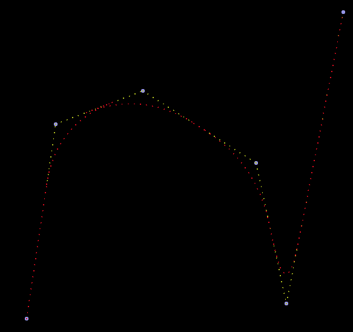

# CPP Bezier Path Interpolation

This project was made by Elio OUEDRAOGO, aiming to visualize Path Smoothing with Bezier Curves.
As it was a small project, there probably won't be any modifications in the future. This repository only serve as a showcase of the code.\

## Usage of the code

The first step is to make all cpp files using the command `make`.\
Then, the execution of the `pathing` executable will pop a SFML. Clicking on it add the dots.
To leave the renderer, simply press `<Ctrl-C>`.\

Link to the documentation : [https://codedocs.xyz/EOued/Bezier-Path-Interpolation/](https://codedocs.xyz/EOued/Bezier-Path-Interpolation/)
